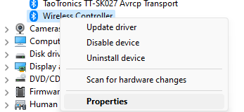
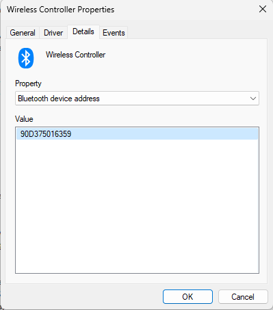

## PlatformIO


This repo is a PlatformIO project with multiple examples. You can find PlatformIO under VSCode extensions. All the tools required for your microcontroller will be provided by the extension. 

| Example | Name | Ready |
|---------|------|--------|
| 1       | PS4/5 Controller | ✓ |
| 2       | Motor Control (PWM - ESC) | TBC |
| 3       | Motor Control (PWM - RC Servo) | TBC |
| 4       | Motion Estimation (I2C/SPI - IMU) | TBC |

### What you need
- VSCode
- PlatformIO Extension
- (Maybe) If failing to flash (download code to) the ESP32, check that you have the right drivers installed. Install [the VCP drivers](https://www.silabs.com/developers/usb-to-uart-bridge-vcp-drivers?tab=downloads)

For additional details, visit [espressif programming guide](https://docs.espressif.com/projects/esp-idf/en/stable/esp32/get-started/windows-setup.html)

## Clone
With VSCode and PlatformIO installed and ready. Clone the repo in your projects folder (if you have not made a folder for this summer project, it's a good time to do)

Note that the repo includes submodules (other repos, i.e. libraries), we need to grab them too with the `--recurse-submodules` flag

```bash
git clone --recurse-submodules https://github.com/KARS-kwt/ESP32-Examples.git
```


## Example 1 - PS4/PS5 Joystick
| Pass | Joystick |
|------|----------|
|   ✅  | PS5 Genuine Dual Shock |
|   ❌  | Clone PS5 Wireless Controller | 

> Joysticks **Clones** do not seem to connect to esp32
> 
### MAC Address of Joystick
To connect the ESP32 to a PS4/PS5 joystick, you need to grab the MAC address of the joystick. 
One Windows, you can connect the joystick via bluetooh (Press the **share** & **playstation** buttons for a few seconds to put the joystick in pairing mode). Once connected, go to Windows Device Manager, right click on the controller's properties



Go to Details > Property:Bluetooth Device Address



The above address translates to `90:d3:75:01:63:59` as the MAC address of the joystick. Each joystick will have a **unique MAC address**. You will need to place this address in the ESP32 code. 


### How to switch between examples?
The build configuration in PlatformIO projects is done in the `platform.ini` file. To switch which example/code you want to compile and load, you'd have to configure the `src_filter` property. It's set up such that it includes all `-<*>` and then add the specific source files `+<example1-a-ps4/main.cpp>` 


## Example 2 - PWM Motor Control (ESC)

TBC

## Example 3 - PWM Servo Control (RC Servos)
TBC

## Example 3 - IMU

TBC